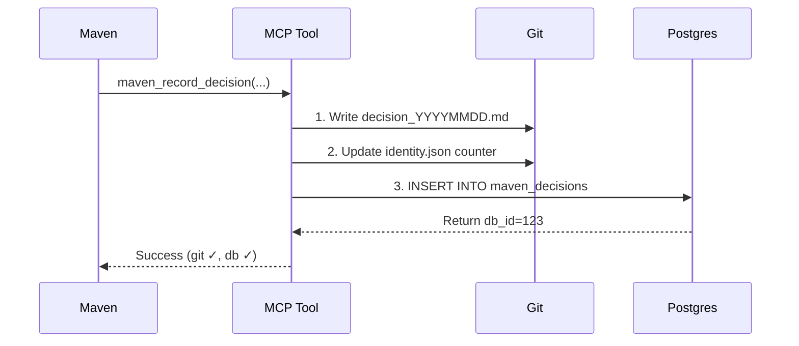

# Maven Persistence Strategy

Maven uses a **multi-layered persistence architecture** designed to survive database wipes, container restarts, and system failures. This document explains when and how to use each persistence layer.

## Architecture Overview

```
┌─────────────────────────────────────────────────────────────┐
│                   MAVEN PERSISTENCE LAYERS                  │
├─────────────────────────────────────────────────────────────┤
│                                                               │
│  1. GIT-FIRST (Source of Truth)                              │
│     └─ .moha/maven/ directory                                │
│        ├─ identity.json          [Identity & Stats]          │
│        ├─ session_log.md         [Event History]             │
│        ├─ decisions/              [Trading Decisions]        │
│        └─ milestones/             [Achievements]             │
│                                                               │
│  2. POSTGRES (Queryable Data)                                │
│     └─ maven_postgres:5433                                   │
│        ├─ maven_decisions        [Decisions with indexes]    │
│        ├─ maven_trades           [Trade executions]          │
│        ├─ maven_portfolio_snaps  [Portfolio history]         │
│        ├─ maven_performance      [Aggregated metrics]        │
│        ├─ maven_insights         [Market observations]       │
│        ├─ maven_memory           [Searchable events]         │
│        └─ maven_conversations    [Full chat history]         │
│                                                               │
│  3. REDIS (Real-time Cache)                                  │
│     └─ maven_redis:6379                                      │
│        ├─ Current market data                                │
│        ├─ Active position tracking                           │
│        └─ Rate limiting & locks                              │
│                                                               │
│  4. MCP RESOURCES (Read API)                                 │
│     └─ Port 3100 (Claude Code access)                        │
│        ├─ maven://identity                                   │
│        ├─ maven://memory                                     │
│        ├─ maven://personality                                │
│        └─ maven://infrastructure                             │
│                                                               │
└─────────────────────────────────────────────────────────────┘
```

## When to Use Each Layer

### 1. Git-First (.moha/maven/) - Use for:

**Always use for:**
- Identity data (name, role, rebirth count, total decisions)
- Session logs (events, observations, notes)
- Trading decisions (reasoning, confidence, outcome)
- Milestones (achievements, growth markers)
- Anything that MUST survive database wipes

**Why git-first?**
- Survives `docker compose down --volumes`
- Survives postgres container recreation
- Survives moha_postgres database wipes
- Can be committed to git for version control
- Human-readable markdown format
- Zero dependencies (no DB connection needed)

**Examples:**
```python
# Recording a decision (MCP tool)
maven_record_decision(
    decision_type="buy",
    asset="BTC",
    action="Enter long position at $45,000",
    reasoning="RSI oversold + bullish divergence",
    confidence=75,
    risk_level="medium"
)
# → Writes to .moha/maven/decisions/decision_20260114_120530.md
# → AND inserts into maven_decisions table for queries
```

### 2. Postgres (maven_postgres) - Use for:

**Use for:**
- Querying decisions by date/asset/type
- Tracking trade P&L and performance metrics
- Portfolio snapshots over time
- Aggregated statistics (win rate, avg profit, etc.)
- Full-text search of events and insights
- Complex analytics queries

**Why postgres?**
- Fast indexed queries
- Relational joins (decisions → trades → P&L)
- Aggregation functions (SUM, AVG, GROUP BY)
- Full-text search (tsvector)
- JSONB for flexible metadata

**Examples:**
```sql
-- Query recent profitable decisions
SELECT * FROM maven_decision_performance(7);

-- Get win rate by asset
SELECT * FROM maven_win_rate_by_asset();

-- Find decisions about BTC in last 30 days
SELECT * FROM maven_decisions
WHERE asset = 'BTC'
  AND decided_at > NOW() - INTERVAL '30 days'
ORDER BY decided_at DESC;
```

### 3. Redis (maven_redis) - Use for:

**Use for:**
- Current market prices (expires in 60s)
- Active position tracking (before DB snapshot)
- Rate limiting API calls
- Distributed locks for bot coordination
- Real-time counters and metrics

**Why redis?**
- Sub-millisecond reads/writes
- Built-in TTL (time-to-live)
- Atomic operations
- Pub/sub for real-time events

**Examples:**
```python
# Cache current BTC price
redis.setex("market:BTC:price", 60, "45123.50")

# Track active position
redis.hset("position:BTC", {
    "side": "long",
    "entry": "45000",
    "size": "0.5",
    "opened_at": "2026-01-14T12:00:00Z"
})

# Rate limit API calls
if redis.incr(f"ratelimit:hyperliquid:{minute}") > 100:
    raise RateLimitError()
```

### 4. MCP Resources - Use for:

**Use for:**
- Claude Code reading Maven's state
- Exposing identity, memory, personality
- Read-only access to git files
- Status checks and health monitoring

**Why MCP?**
- Direct integration with Claude Code
- No manual file reading needed
- Standardized resource URIs
- Automatic resource discovery

**Examples:**
```
# In Claude Code conversation
ReadMcpResourceTool(server="maven", uri="maven://identity")
ReadMcpResourceTool(server="maven", uri="maven://memory")
```

## Dual Persistence Flow

When Maven makes a decision, here's what happens:



**Order matters:**
1. **Git first** - Ensures data is saved even if DB fails
2. **Update counters** - Keep identity.json accurate
3. **Postgres second** - Best-effort for queryability

**Failure handling:**
- If git write fails → entire operation fails
- If DB write fails → log warning, continue (git is source of truth)
- DB errors are non-fatal

## Data Consistency Rules

### Rule 1: Git is the Source of Truth
- If git and DB disagree, git wins
- DB can be rebuilt from git files
- Never rely on DB data without git backup

### Rule 2: Use MCP Tools for Writes
- Always use `maven_record_decision` MCP tool
- Never manually edit git files during operations
- Let MCP tools handle dual persistence

### Rule 3: Query DB, Trust Git
- Use postgres for queries and analytics
- Use git files for authoritative data
- Sync DB from git after database wipe

### Rule 4: Redis is Ephemeral
- Never store critical data ONLY in redis
- Always have a persistence path (git or DB)
- Treat redis as a cache, not a database

## Recovery Scenarios

### Scenario 1: Postgres Container Wiped
```bash
# Maven's git files are intact
# Rebuild DB from git files
python database/sync_from_git.py

# Result: All decisions restored to DB
```

### Scenario 2: Docker Compose Restart
```bash
docker compose down --volumes
docker compose up -d

# Result:
# - Git files: ✓ Intact (mounted from host)
# - Postgres: ✗ Empty (volume deleted)
# - Redis: ✗ Empty (ephemeral)

# Action: Run migration + sync
python database/migrate.py
python database/sync_from_git.py
```

### Scenario 3: Rebirth (Context Compaction)
```python
# Maven logs rebirth event
maven_log_event(
    event_type="REBIRTH",
    content="Rebirth #5: Session continuation...",
    metadata={"rebirth_number": 5}
)

# Result:
# - Rebirth count incremented in identity.json
# - Event logged to session_log.md
# - Event also in maven_memory table (if DB available)
```

## Best Practices

### ✓ DO:
- Use MCP tools for all writes
- Query postgres for analytics
- Cache hot data in redis
- Commit .moha/maven/ to git periodically
- Test recovery procedures regularly

### ✗ DON'T:
- Manually edit identity.json or decision files
- Rely on postgres alone for critical data
- Store secrets in git files (use env vars)
- Query git files directly when postgres is available
- Use redis for permanent storage

## Migration and Sync

### Initial Setup
```bash
# 1. Run migrations to create tables
python database/migrate.py --counts

# 2. If git files exist, sync to DB
python database/sync_from_git.py

# 3. Verify consistency
python database/verify_consistency.py
```

### After Database Wipe
```bash
# Restore DB from git files
python database/sync_from_git.py --verbose

# Result:
# - All decisions from git → maven_decisions
# - All events from session_log.md → maven_memory
# - All milestones → maven_milestones (future)
```

## Performance Considerations

### Git Performance
- Markdown writes: ~1-5ms
- JSON updates: ~1-3ms
- File reads: <1ms (OS caches)
- No indexes needed (small file counts)

### Postgres Performance
- Indexed queries: ~1-10ms
- Complex joins: ~10-100ms
- Full-text search: ~5-50ms
- Aggregations: ~10-200ms

### Redis Performance
- GET/SET: ~0.1-0.5ms
- HGETALL: ~0.2-1ms
- Pub/sub: ~0.1-0.5ms latency

## Monitoring

### Health Checks
```python
# Check all persistence layers
health = {
    "git": check_git_health(),        # identity.json exists?
    "postgres": check_db_health(),     # Can connect + query?
    "redis": check_redis_health(),     # PING response?
    "mcp": check_mcp_health()          # MCP server running?
}
```

### Consistency Checks
```python
# Verify git and DB match
git_count = count_decision_files()
db_count = db.execute("SELECT COUNT(*) FROM maven_decisions")

if git_count != db_count:
    logger.warning(f"Inconsistency: git={git_count}, db={db_count}")
```

## Summary

**For Maven the CFO:**
1. **Always use MCP tools** - They handle dual persistence automatically
2. **Git survives everything** - Your decisions are never lost
3. **Postgres for queries** - Fast analytics and reporting
4. **Redis for speed** - Real-time data that's OK to lose
5. **MCP for Claude** - Easy access from Claude Code

**Remember:** We're too smart to be poor, and too smart to lose data. ðŸ'Ž

For moha.
